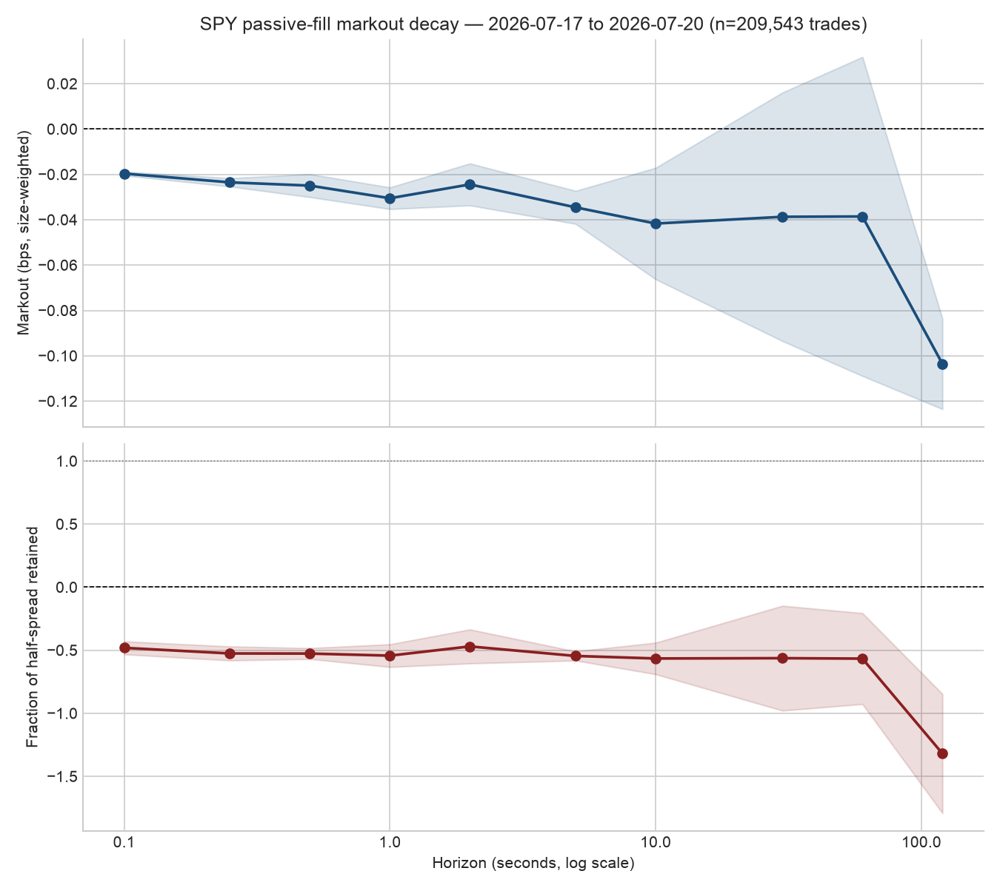

# Order-Flow Toxicity: Does VPIN Predict Passive Market-Maker Losses?

Quantitative research project on adverse selection in US equities, framed
around a hypothetical passive market maker in **SPY**.

**Research question.** Can publicly observable order-flow features (signed
trade imbalance, order-flow imbalance, trade-arrival intensity, momentum,
spread, realized volatility, depth imbalance, run length) predict the
losses a passive liquidity provider takes when it gets "picked off"? And
does VPIN (Volume-Synchronized Probability of Informed Trading) add any
marginal predictive value beyond those simpler features? VPIN is one
contestant in a horse race, not the assumed answer.

SPY is the instrument because it is the most liquid ETF in the world, so
results are natively relevant to ETF market making and there is no shortage
of ticks.

## Status

| Phase | Description | Status |
|---|---|---|
| 1 | Feature construction: markout curve, then order-flow features + VPIN | **Step 1 (markout curve) done on real data** |
| 2 | Horse-race regression: markout ~ features, isolate VPIN's contribution | not started |
| 3 | Simulated quoting policies (static / VPIN-gated / composite toxicity) | not started |
| 4 | Policy comparison write-up | not started |
| 5 | (stretch) Regime splits: open vs. midday, news vs. ordinary days | not started |

## Headline result: the SPY passive-fill markout curve

If you were the passive counterparty to every trade in SPY, how much of the
quoted half-spread do you still have *h* seconds after the fill?



Size-weighted means, 2 trading days (2026-07-17 and 2026-07-20), 209,543
trades, Nasdaq (`XNAS.ITCH`) top-of-book:

| Horizon | Markout (bps) | Fraction of half-spread retained |
|---|---|---|
| 0 s | +0.124 | +0.96 |
| 0.1 s | -0.020 | -0.48 |
| 1 s | -0.031 | -0.54 |
| 10 s | -0.042 | -0.57 |
| 60 s | -0.039 | -0.57 |
| 120 s | -0.104 | -1.32 |

Reading: at t=0 the passive fill has earned the half-spread (the sign
convention check, `X(0) = +half spread`, passes on real data). Within 100
milliseconds the mid has moved through the fill price and the position is
underwater by roughly half a half-spread, and it never recovers. On this
feed, naive passive liquidity provision in SPY is adversely selected almost
immediately. The full table with equal-weighted means and standard errors is
in [`markout/output/SPY_markout_table.csv`](markout/output/SPY_markout_table.csv);
the size-quintile cut is in
[`markout/output/SPY_markout_quintiles.csv`](markout/output/SPY_markout_quintiles.csv).

### Read the caveats before quoting this

1. **Two trading days.** Standard errors cluster on daily means, so with two
   days they have one degree of freedom. The shaded bands on the chart are
   not meaningful yet. The pipeline is built for a 20-day window; the
   remaining 18 days have not been pulled (see "Data" below).
2. **Single-venue book.** The mid is Nasdaq's top of book, not the NBBO.
   A fill at Nasdaq's ask often *is* the event that empties that level, so
   the Nasdaq mid ticks against you mechanically. That biases measured
   adverse selection upward relative to a consolidated-book benchmark.
   The mean quoted spread on this feed is $0.019, roughly twice the NBBO's
   usual one-tick spread, for the same reason.
3. **Every trade is assumed to be a passive fill for us.** Real fill
   probability depends on queue position, and a real market maker gets
   filled on a biased (worse) subset of this flow.
4. No inventory, hedging, fees, or rebates. Markouts are against the mid,
   not an achievable exit price.

## Data

Databento `mbp-1` schema (trades and top-of-book quotes in one stream),
dataset `XNAS.ITCH` (Nasdaq direct feed). Raw and processed data are not
committed; they are large and licensed. Only the aggregate outputs in
`markout/output/` are in the repo.

**Why a single-venue feed and not the consolidated one.** The first pull used
`EQUS.MINI`, Databento's consolidated US-equities sample feed. About 91% of
its trades reported an unknown aggressor side, because the consolidated feed
anonymizes side. That is a property of the feed, not a bug. Switching to
`XNAS.ITCH` cut unknowns to 8-13% at the raw level. The remainder comes
from two sub-populations, both now handled explicitly:

- Trades in the first and last seconds of the session (auction prints).
  Dropped with a 5-second buffer around 09:30 and 16:00.
- Trades with `flags == 128`, which are all unknown-side and appear to be
  non-displayed (hidden or midpoint-pegged) liquidity. These are routed to a
  separate `*_trades_excluded.parquet` per day so they stay auditable, not
  silently dropped.

After both steps, 2-4% of remaining trades still have unknown side and are
classified by the quote rule (above mid = buy-initiated, below = sell). That
share is reported per day by `clean.py` and is under the 5% threshold at
which the pipeline stops and refuses to proceed.

Per-day cleaning summary for the two days in the sample:

| Day | Raw trades (RTH) | Auction drop | Horizon drop | Flagged (excluded) | Unknown-side fallback | Final trades |
|---|---|---|---|---|---|---|
| 2026-07-17 | 118,272 | 1,207 | 3,706 | 10,771 | 3.5% | 102,588 |
| 2026-07-20 | 117,662 | 930 | 3,052 | 6,725 | 2.1% | 106,955 |

## Repo layout

```
markout/            Phase 1, Step 1: the markout pipeline (see markout/README.md)
  src/              fetch -> clean -> markout -> aggregate -> validate -> plot
  tests/            30 pytest tests
  output/           committed aggregate results (chart + CSVs)
  config.yaml       symbol, dataset, horizons, session, thresholds
docs/superpowers/   design spec and implementation plan for the pipeline
```

## Running it

```bash
cd markout
uv sync
cp .env.example .env        # add your Databento key
uv run pytest
uv run python -m src.fetch --max-days 1     # one day first; prints cost estimate
uv run python -m src.clean
uv run python -m src.markout
uv run python -m src.aggregate
uv run python -m src.plot                   # runs validation checks, then draws the chart
```

There is also a synthetic-data path (`python -m src.synth`, then every stage
with `--symbol SYNTH`) that exercises the whole pipeline with no API key.
Details, assumptions, and the validation checks are in
[`markout/README.md`](markout/README.md).
