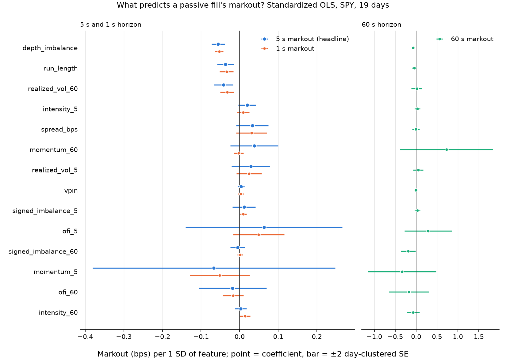
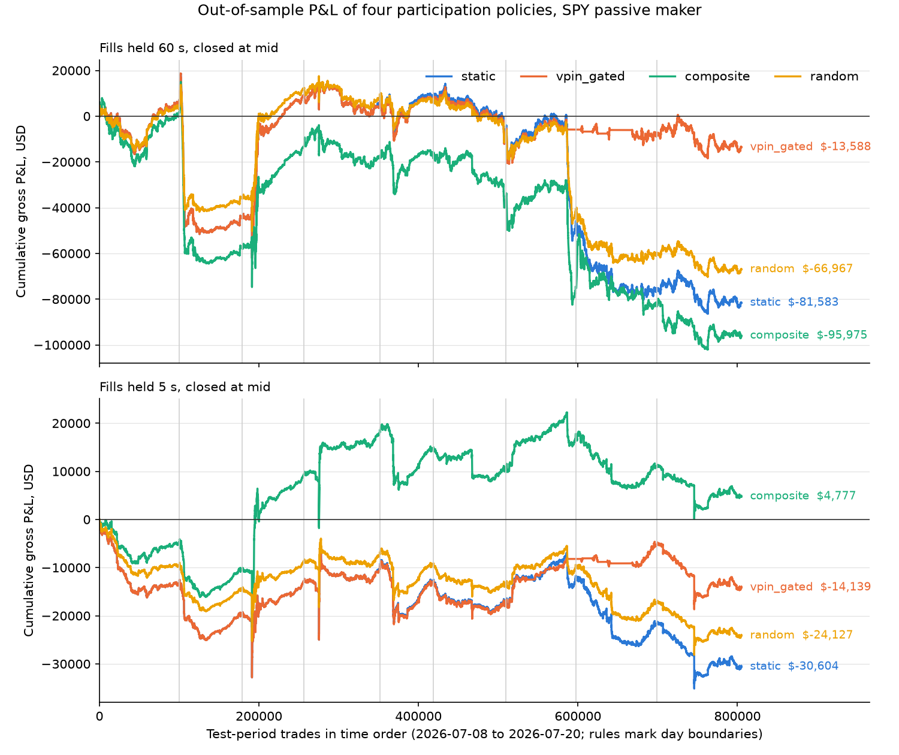
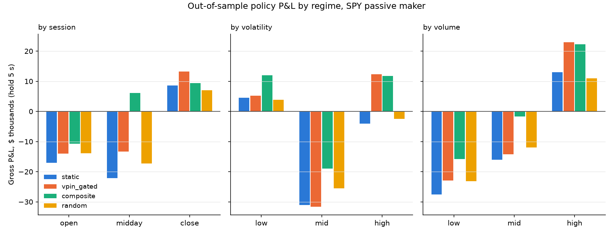

# SPY Order-Flow Toxicity Pipeline

All the code for the order-flow-toxicity project, as one pipeline of
standalone stages. It starts from the passive-fill markout decay curve for
SPY (if you were the passive counterparty to every trade, how much of the
quoted half-spread do you still have at horizon *h*?), builds the
order-flow features and VPIN on top of it, runs the horse-race regression,
simulates participation policies out of sample, and splits everything by
regime. Results are in the "Phase N result" sections below; the project
overview and bottom line are in the [root README](../README.md).

Sign convention: for trade *i* at price *Pᵢ* with aggressor side *Aᵢ*
(+1 buyer-initiated, −1 seller-initiated), the passive maker's position is
*qᵢ = −Aᵢ* and

```
X_i(h) = -A_i * (M(t_i + h) - P_i)
```

so `X(0)` must equal `+half spread`. That identity is the first blocking
validation check and it passes on real data.

## Setup

```bash
cd markout
uv sync
cp .env.example .env  # fill in DATABENTO_API_KEY
```

## Running

```bash
uv run python -m src.fetch --max-days 1   # one day first; prints the cost estimate
uv run python -m src.clean
uv run python -m src.markout
uv run python -m src.features             # per-trade order-flow features + VPIN
uv run python -m src.aggregate
uv run python -m src.plot                 # validation report, then the chart
uv run python -m src.regress              # Phase 2 horse-race regression
uv run python -m src.policy               # Phase 3 quoting-policy comparison
uv run python -m src.regimes              # Phase 5 regime splits
```

`fetch.py` caches one parquet per day in `data/raw/` and never re-downloads a
day that exists. The window is `n_trading_days` ending the trading day
before `--as-of` (default: today). The results in this repo use the 20-day
window ending 2026-07-20 (19 trading days plus the July 3 holiday), which is

```bash
uv run python -m src.fetch --as-of 2026-07-21
```

The stages after `fetch` and `clean` take seconds; `clean` and `markout`
take a few minutes for 19 days.

Synthetic dry run of the Phase 1 stages (no API key needed):

```bash
uv run python -m src.synth
uv run python -m src.clean --symbol SYNTH
uv run python -m src.markout --symbol SYNTH
uv run python -m src.aggregate --symbol SYNTH
uv run python -m src.plot --symbol SYNTH
```

## Pipeline stages

| Module | Does |
|---|---|
| `src/fetch.py` | Databento `mbp-1` pull, dataset pinned via `dataset_override` in `config.yaml`, cost estimate, per-day parquet cache. |
| `src/synth.py` | Synthetic raw day in the exact `fetch.py` schema, for plumbing tests. |
| `src/clean.py` | RTH filter (09:30–16:00 ET), UTC to New York conversion, quote validity, auction-print drop (5 s buffer), horizon-cutoff drop, `flags != 0` exclusion to a separate auditable parquet, aggressor-side classification with a quote-rule fallback. |
| `src/markout.py` | The markout computation, all three units (dollars, bps, fraction of half-spread), horizons 0 to 120 s. Carries top-of-book sizes through for the features stage. |
| `src/features.py` | Trailing-window order-flow features and VPIN appended to every markout row, plus a descriptive summary and five sanity checks. See "Features" below. |
| `src/aggregate.py` | Daily size- and equal-weighted markout means, standard errors clustered on daily means, size-quintile cut. |
| `src/validate.py` | The Phase 1 checks (`X(0)` = +half spread, buy share 45–55%, mean spread ≤ $0.02, daily trade-count stability, no NaNs, monotone-ish decay as advisory) and the `CheckResult` / `ValidationReport` types every later stage reuses for its own checks. |
| `src/plot.py` | Two-panel markout chart (bps and fraction of half-spread, log-x, ±2 SE bands), gated on the blocking checks. |
| `src/regress.py` | Phase 2: pooled OLS of markouts on the features with day-clustered SEs, VPIN's marginal value, leave-one-out ranking, decile sort, coefficient chart. See "Phase 2 result" below. |
| `src/policy.py` | Phase 3: static, VPIN-gated, composite, and random participation policies evaluated out of sample with walk-forward thresholds; comparison table, daily P&L, cumulative P&L chart. See "Phase 3 result" below. |
| `src/regimes.py` | Phase 5: the markout, the VPIN test, and the Phase 3 policy P&L within session, volatility-tercile, and volume-tercile regimes. See "Phase 5 result" below. |

## Outputs

Committed, in `output/`:

| Stage | Files |
|---|---|
| Phase 1 markout | `SPY_markout_curve.png`; `SPY_markout_table.csv` (one row per horizon: means, SEs, t-stats, n); `SPY_markout_quintiles.csv` (means by trade-size quintile) |
| Phase 1 features | `SPY_feature_summary.csv` (per-feature count, null share, mean, std, 1st/50th/99th percentiles) |
| Phase 2 | `SPY_horse_race.png`; `SPY_horse_race.csv` (all coefficients, three horizons); `SPY_vpin_marginal.csv`; `SPY_leave_one_out.csv`; `SPY_decile_sort.csv` |
| Phase 3 | `SPY_policy_pnl.png`; `SPY_policy_comparison.csv` (policy × hold); `SPY_policy_daily_pnl.csv` |
| Phase 5 | `SPY_regime_policy_pnl.png`; `SPY_regime_table.csv` |
| synthetic dry run | `SYNTH_*` counterparts of the Phase 1 files |

Not committed, in `data/processed/`:

- `SPY_<day>_markouts.parquet` — one tidy row per trade with every
  horizon's markout.
- `data/processed/SPY_<day>_features.parquet` (not committed) — the same
  rows as the markouts file, in the same order, with the feature columns
  appended. This is the Phase 2 input: one file, no joins.
- `data/processed/SPY_<day>_trades_excluded.parquet` (not committed) — the
  `flags != 0` trades routed around classification, kept for audit.

## Features

Every feature is computed from information timestamped strictly before the
trade. Windowed features use trailing half-open windows [t − W, t) with
W ∈ {5 s, 60 s} (`feature_windows_seconds` in `config.yaml`); a trade never
sees itself or any record sharing its exact timestamp, so the legs of a
sweep cannot see each other. Quote-stream lookups are asof at t − 1 ns.

| Column | Definition | Units |
|---|---|---|
| `signed_imbalance_{W}` | (buy volume − sell volume) / total volume in window; null if empty | [−1, 1] |
| `ofi_{W}` | Cont–Kukanov–Stoikov order-flow imbalance summed over top-of-book updates in window | shares |
| `intensity_{W}` | trades in window / W | trades per second |
| `momentum_{W}` | (mid at fill − mid at t − W) / mid at t − W | bps |
| `realized_vol_{W}` | root sum of squared log mid changes between consecutive trades in window; null if fewer than 2 trades | bps |
| `spread_bps` | quoted spread at fill / mid | bps |
| `depth_imbalance` | (bid size − ask size) / (bid size + ask size) at the fill, from the trade record's own book | [−1, 1] |
| `run_length` | signed count of consecutive same-side trades immediately before this one; 0 for the first trade of the day | trades |
| `vpin` | mean absolute order imbalance over the last 50 volume buckets (below) | [0, 1] |

**VPIN.** Buckets hold 1/50 of average daily classified volume
(`vpin_buckets_per_day`); each bucket's imbalance is |buy − sell| / volume
using the actual aggressor side; VPIN is the mean over the last 50 completed
buckets (`vpin_window_buckets`), roughly one day of volume. Each trade
receives the VPIN as of the last bucket completed before it. Bucket state
carries across days, so `features.py` processes days in date order and a
single day cannot be recomputed in isolation. VPIN is null for
approximately the first trading day of the sample while the window warms
up. A trade is assigned whole to the bucket its cumulative volume starts
in, not split; at these bucket sizes the misallocation is negligible. On
the current sample, ADV is 5.77M shares, so each bucket is about 115k
shares, and VPIN becomes available after the first 108,991 trades (inside
day one, which ran above average volume).

**Checks** (blocking, printed after the run): no infinite values; no NaN
values (this caught a polars sliding-sum drift to −3e−24 that turned 29
realized-vol windows into NaN; now clipped at zero); null share under 1%
for every 60 s feature; VPIN nulls form a prefix; bounded features within
their ranges.

## Phase 2 result: the horse race

Pooled OLS of the markout (bps of mid) on all 14 features over 1,759,429
trades and 19 days, after dropping the 7.1% of rows with a null (mostly
the VPIN warm-up). Directional features are multiplied by aggressor side so
positive means "flow in the direction of the incoming trade". Regressors are
winsorized at 0.1% / 99.9% and z-scored, so a coefficient is bps of markout
per one standard deviation of the feature. Standard errors are clustered by
day. Headline horizon 5 s; 1 s and 60 s as robustness.



**Finding.** VPIN adds nothing. In the full model its coefficient is +0.004
bps per SD (t = 0.9); removing it changes R² by 0.0000 at every horizon;
alone it explains 0.00% of the variance. The features that do predict
markouts are book state, not flow history: top-of-book depth imbalance on
the side being hit is the strongest predictor at every horizon (t = −6.4 at
5 s, −10.2 at 1 s), followed by run length and 60 s realized volatility.
Signed trade imbalance, the textbook adverse-selection signal, is
indistinguishable from zero at 5 s, alone or with controls, on this
single-venue book.

| | 5 s | 1 s | 60 s |
|---|---|---|---|
| R², full model | 0.46% | 1.23% | 2.53% |
| R² without VPIN | 0.46% | 1.23% | 2.53% |
| VPIN t-stat | 0.9 | 0.8 | −0.2 |
| Largest leave-one-out ΔR² | depth_imbalance, 0.15 pp | depth_imbalance, 0.46 pp | momentum_60, 2.34 pp |
| Decile 10 − decile 1 realized markout | 0.28 bps | 0.21 bps | 0.62 bps |

Tables: [`output/SPY_horse_race.csv`](output/SPY_horse_race.csv) (all
coefficients), [`output/SPY_vpin_marginal.csv`](output/SPY_vpin_marginal.csv),
[`output/SPY_leave_one_out.csv`](output/SPY_leave_one_out.csv),
[`output/SPY_decile_sort.csv`](output/SPY_decile_sort.csv).

**What the decile sort says.** Sorting fills by the model's predicted 5 s
markout, the worst decile realizes −0.11 bps and the best +0.17 bps, a
spread of 0.28 bps, about two ticks at SPY's price. The best-looking decile
of fills is profitable on average. So a very low R² still carries a usable
ordering, which is what Phase 3's quoting policies need.

**Caveats.** R² of a few percent is normal for tick-level markout
regressions and is not a failure of the features. Nineteen clusters make
the SEs somewhat optimistic; t-statistics near 2 should not be over-read.
VPIN's window is about one day of volume, so its identification is largely
across days; a faster VPIN (`vpin_window_buckets: 10`) is the natural
robustness run if anyone wants to rescue it. The decile sort is in-sample,
though with 15 parameters and 1.76M rows overfitting is not the concern;
regime change is. The depth-imbalance result is at least partly the
single-venue mechanical effect: a thin queue on the hit side is exactly the
state in which one fill empties the Nasdaq level and moves the Nasdaq mid.

## Phase 3 result: does reacting to toxicity help?

Four participation policies for a passive maker, evaluated out of sample.
The Phase 2 model is fitted on the first 10 days; the last 9 days are the
test. A policy decides per trade whether to take the passive side for up to
100 shares; each fill is held H seconds and closed at the mid, so its P&L
is its H-second markout. Gated policies target a 20% sit-out rate with
thresholds recalibrated each test day from all prior days (a fixed
train-period VPIN cutoff transferred badly: VPIN's level drifts week to
week and the policy sat out 2.7% instead of 20%). The random policy sits
out 20% by coin flip and is the null.



Test period 2026-07-08 to 2026-07-20, 805,063 trades, $27.8B notional for
the static policy.

| Policy | Fill rate | Gross P&L, hold 60 s | Max drawdown | Mean abs inventory | vs. static, daily t | Gross P&L, hold 5 s | vs. static, daily t |
|---|---|---|---|---|---|---|---|
| static | 100% | −$81.6k | $105k | 3,469 sh | | −$30.6k | |
| vpin_gated | 88% | −$13.6k | $81k | 2,904 sh | +1.4 | −$14.1k | +1.3 |
| composite | 80% | −$96.0k | $117k | 3,878 sh | −0.5 | **+$4.8k** | **+2.6** |
| random | 80% | −$67.0k | $88k | 2,791 sh | +0.8 | −$24.1k | +1.2 |

Tables: [`output/SPY_policy_comparison.csv`](output/SPY_policy_comparison.csv),
[`output/SPY_policy_daily_pnl.csv`](output/SPY_policy_daily_pnl.csv).

**Reading.** Passive participation in every SPY trade on this book loses
money at every hold: the spread captured ($359k) is smaller than the
adverse move. The composite policy, which stands down on the 20% of
trades the Phase 2 model flags as most toxic, is the only policy that is
profitable, and only at the 5-second hold that matches its signal
horizon: +$4.8k against static's −$30.6k, better than static on 8 of 9
days, paired t = 2.6. At a 60-second hold the same policy is no better
than sitting out at random, because the signal it uses (mostly depth on
the hit side) predicts the next few seconds, not the next minute. The
VPIN policy's improvement at 60 s (+$68k) comes almost entirely from two
days, 2026-07-16 and 2026-07-17, on which VPIN's daily level was high and
the book lost heavily; across the 9 days that is t = 1.4, not
distinguishable from luck, and it is a day-selection effect rather than a
trade-selection one, since VPIN barely moves within a day.

**Desk-level answer.** Reacting to estimated toxicity helps only when the
signal's horizon matches the holding horizon. A short-horizon book-state
signal (depth imbalance on the side being hit, run length, recent
volatility) turns a losing passive book into a roughly break-even one by
passing on one trade in five, and does it consistently day to day. VPIN
does not select trades; at best it selects days, and in this sample two
days carry the whole effect. Widening or standing down on VPIN alone
would have cost fill rate on most days for a benefit that cannot be
separated from noise.

**Caveats.** Nine test days. No queue model: every trade we participate in
is assumed to fill, which flatters every policy equally but hides that a
real maker is filled on the worse subset. No hedging, fees, or rebates.
The 100-share cap makes inventory a queue-of-fills count, not a real
position. Single-venue book: the depth effect the composite policy trades
on is partly Nasdaq-level depletion that a consolidated quote would soften.
P&L in bps of notional is about 0.01 either way; the sample is a one-tick
book and the numbers are small by construction.

## Phase 5 result: regime splits

Three splits of the same per-trade table: session (open 09:30 to 10:00,
midday, close 15:30 to 16:00), terciles of trailing 60 s realized vol,
and terciles of trailing 60 s trade intensity. Per regime: the
size-weighted mean markout with a day-clustered SE, the Phase 2 full
model refit on the regime's rows (VPIN's t and the top feature), and the
Phase 3 policies' out-of-sample P&L on the regime's test trades using the
already-fitted masks. Full table:
[`output/SPY_regime_table.csv`](output/SPY_regime_table.csv).



| Regime | Share | 5 s markout (bps, SE) | VPIN t | Top feature (t) | Composite vs static at 5 s, paired t |
|---|---|---|---|---|---|
| open | 12% | −0.062 (0.026) | 0.8 | spread_bps (2.9) | 1.9 |
| midday | 71% | −0.019 (0.008) | 1.0 | depth_imbalance (−5.5) | 2.2 |
| close | 17% | +0.011 (0.011) | 0.3 | depth_imbalance (−7.5) | 0.7 |
| low vol | 33% | +0.005 (0.007) | 1.7 | depth_imbalance (−7.2) | 4.5 |
| mid vol | 33% | −0.029 (0.010) | 1.9 | depth_imbalance (−6.6) | 4.9 |
| high vol | 33% | −0.032 (0.022) | −1.0 | depth_imbalance (−3.9) | 1.2 |
| low volume | 33% | −0.022 (0.007) | 2.1 | depth_imbalance (−8.0) | 7.7 |
| mid volume | 33% | −0.023 (0.008) | 1.1 | depth_imbalance (−7.7) | 5.5 |
| high volume | 33% | −0.011 (0.019) | −0.7 | depth_imbalance (−4.2) | 0.7 |

**Is adverse selection worse at the open?** Yes, by about three times:
−0.062 bps at 5 s against −0.019 midday. At the close it is gone; passive
fills in the last half hour keep the half-spread on average at 5 s
(+0.011, not distinguishable from zero) and the loss only shows up at 60 s.
The open is also the one regime where the quoted spread, not depth, is
the strongest predictor: wide quotes at the open are the toxic ones.

**Is there a regime where VPIN matters?** No. VPIN's t-statistic is
between −1.0 and 2.1 in all nine regimes and its R² contribution rounds
to zero in every one. Where it is closest to significant (low volume,
t = 2.1) the sign is positive, meaning higher VPIN went with better
markouts, the opposite of the toxicity story. Depth imbalance on the hit
side is the top feature in eight of nine regimes.

**Where does the composite policy earn its edge?** In calm, ordinary
trading. Against static at the 5 s hold it wins in every regime, but the
paired t is 4.5 to 7.7 in the low- and mid-volatility and low- and
mid-volume terciles, 1.9 to 2.2 at the open and midday, and under 1.3 in
the high-volatility, high-volume, and close regimes, where every policy
does about equally well and the static book is itself profitable. The
signal identifies bad fills when the book is quiet; when it is busy,
there is less to avoid.

**Caveats.** The test period for the policy columns is still 9 days, so
the regime-level paired t-statistics rest on 9 daily differences each.
Tercile cuts are full-sample. Everything else from Phases 1 to 3 applies.

## What the real data showed

Nineteen trading days of `XNAS.ITCH` are on disk (2026-06-23 to
2026-07-20; 2026-07-03 was a holiday and comes back as a zero-row file,
which `clean.py` skips). The validation report passes all five blocking
checks and the advisory one on the full sample.
The `side` field mapping (`A` = sell aggressor, `B` = buy aggressor) is
confirmed by the `X(0)` check: a flipped mapping would flip its sign.

Aggressor-side coverage:

- The consolidated `EQUS.MINI` feed reports ~91% unknown side because it
  anonymizes side. It is unusable for this purpose; `data/raw_stale/` holds
  that first pull for reference and is ignored by git.
- `XNAS.ITCH` reports 8–13% unknown side at the raw level. Every trade with
  `flags == 128` is unknown-side, and those look like non-displayed
  liquidity; they are excluded to `*_trades_excluded.parquet`
  (161,585 trades, 7.5% of regular-hours trades, across the 19 days). After
  that and the 5 s auction buffer, 2.1% to 3.5% of trades per day remain
  unknown-side and are classified by the quote rule, under the 5% threshold
  at which `clean.py` stops.

## Assumptions and limitations

1. Every trade is treated as though we were the passive counterparty to
   it. Real fill probability is governed by queue position, and a real
   market maker would be filled on a biased, plausibly worse, subset.
2. Markouts are measured against the mid, not an achievable exit price.
3. No inventory, no hedging, no fees or rebates.
4. Single-venue book. The mid is Nasdaq's top of book, not the NBBO. A fill
   that empties a Nasdaq level moves the Nasdaq mid mechanically, so measured
   adverse selection is biased upward relative to a consolidated benchmark.
   The mean quoted spread on this feed ($0.019) is about twice the NBBO's
   usual one tick for the same reason.
5. One month of data (19 trading days). Standard errors cluster on daily
   means, 18 degrees of freedom. Sub-second markouts are significant at
   |t| of roughly 3; beyond a minute the bands are wide.
6. US market holidays are not excluded from the trading-day calculation. A
   holiday in the window shows up as an empty raw file and is caught by the
   trade-count-stability check rather than silently miscounted.
7. Opening and closing auction prints are dropped with a fixed 5 s buffer
   around the session boundary, not a documented auction flag. The `X(0)`
   check is the guardrail against this heuristic contaminating results.
8. The `flags == 128` population is only partially understood. It is
   excluded, not dropped, precisely so it can be revisited.

## Status

- [x] Pipeline built and validated end-to-end against synthetic data.
- [x] Real Databento pull on `XNAS.ITCH`, full 20-day window (19 trading
      days plus one holiday), all validation checks pass, chart and tables
      produced.
- [x] Phase 1 feature construction: signed imbalance, OFI, arrival
      intensity, momentum, realized vol, spread, depth imbalance, run
      length, VPIN, appended row for row to the per-trade markout table.
- [x] Phase 2 horse-race regression: markout ~ features, VPIN's marginal
      contribution isolated. VPIN adds nothing; depth imbalance dominates.
- [x] Phase 3 simulated quoting policies, out of sample: the composite
      policy is the only profitable one and only at its own 5 s horizon
      (t = 2.6); VPIN gating is a two-day effect (t = 1.4).
- [x] Phase 5 regime splits: adverse selection is 3x worse at the open and
      absent at the close; VPIN is insignificant in every regime; the
      composite edge sits in calm, low-to-mid-volume trading.
- [x] Phase 4 write-up: the "Phase N result" sections in this file and the
      bottom line in the root README are the write-up; there is no separate
      document.
